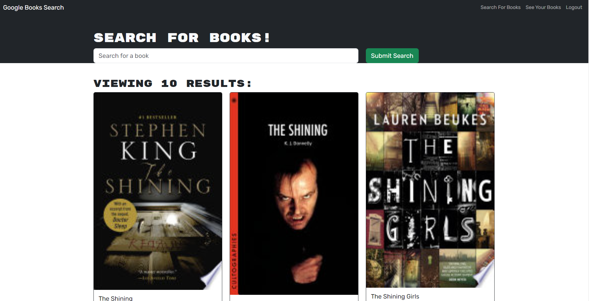

# Book Search Engine

## Description 
Refactored an app built with RESTful API to one built with an Apollo Server that utilizes GraphQL.

## Table of Contents
1. [Installation](#installation)
2. [Usage](#usage)
3. [Contributing](#contributing)
4. [Tests](#tests)
5. [License](#license)
6. [Questions](#questions)

## Installation
You can view the app [here](https://murmuring-river-53647-5e3a0c860313.herokuapp.com/).

## Usage
Screenshot

## Contributing
N/A

## Tests
N/A

## License
Licensed under the [MIT license](https://opensource.org/license/mit/)

## Questions
You can view my GitHub repository here: [JenWariner19/book-search-engine](https://github.com/JenWariner19/book-search-engine) 
If you have any questions and would like to contact me, you can email me at: [jenniferwariner@yahoo.com](mailto:jenniferwariner@yahoo.com)
